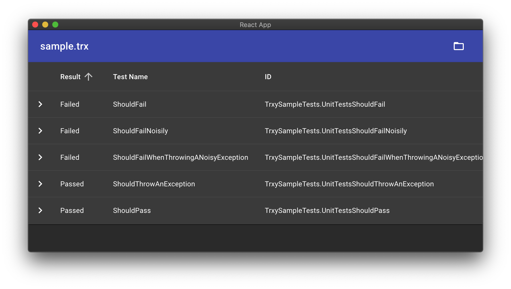

# trxy

View Visual Studio Test results files (`.trx`) on any platform without the need for Visual Studio.



Built with [Create-React-App](https://create-react-app.dev/) and [Electron](https://electronjs.org/).

## Getting Started
```bash
$ npm install
$ npm run start      # serves on localhost:3000 and runs electron
$ npm run web-start  # serves on localhost:3000
$ npm run build      # builds the electron app for the current operating system into /dist
$ npm run sample-trx # generates a sample trx file from /examples/TrxySampleTests
```

Check out [`/examples/TrxySampleTests/TestResults`](/examples/TrxySampleTests/TestResults) for some example files to open!
